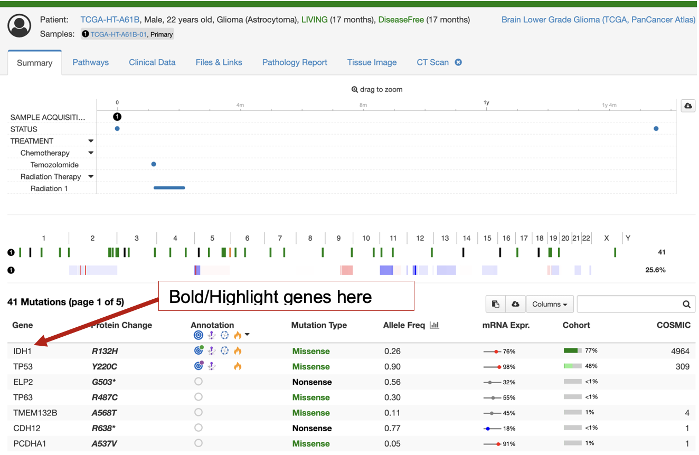

# GSoC 2025: Generate Gene and Pathway Lists for OncoTree Codes using LLM Prompting

> ## 📖 그림책으로 쉽게 보기 (Picture-book explainer)
> 이 프로젝트가 하는 일을 그림과 이야기로 쉽고 재미있게 정리했습니다.
> - **온라인으로 보기:** https://sdkparkforbi.github.io/OncoTree2Genes-LLM/
> - **파일로 보기:** [`docs/index.html`](docs/index.html)
>
> *"AI가 891개 암마다 핵심 유전자를 만들고 → 또 다른 AI가 PubMed 논문으로 채점한다"* — generate-then-verify 이야기.

## Table of Contents

- [Description](#description)
- [Installation](#installation)
- [Example structured outputs](#example-structured-outputs)
- [References](#references)


## Description
### Background:
cBioPortal for Cancer Genomics: An open-source platform that enables interactive exploration and visualization of large-scale cancer genomics datasets.[1,2]

Cancer Classification: Accurate classification of cancer subtypes is essential for diagnosis, prognosis, and treatment. OncoTree provides a standardized, community-driven ontology for cancer subtypes.[3]

OncoTree Integration in cBioPortal: cBioPortal uses OncoTree codes to categorize cancer samples. However, it lacks default gene/pathway recommendations per cancer type, which could enhance data exploration.


### Project overview:
This project, developed as part of Google Summer of Code 2025, aims to enhance the cBioPortal platform by generating a list of recommended default genes and pathways for each OncoTree code. To achieve this goal, we use prompt engineering to query a Large Language Model (LLM) for structured lists of genes, pathways, and molecular subtypes associated with each OncoTree code, as shown here for the OncoTree code 'PAAD' (Pancreatic Adenocarcinoma):

```yaml
{
 "BRCA": {
    "cancer_name": "Invasive Breast Carcinoma",
    "other_codes_used_for_data_gathering": {
      "NCIt": "C9245",
      "UMLS": "C0853879"
    },
    "associated_genes": [
      {
        "gene_symbol": "BRCA1",
        "gene_info": {
          "association_strength": "very strong",
          "reference": "PMID: 12826630|PMID: 10799637|ClinVar",
          "mutations": [
            "Truncating",
            "Splice site",
            "Missense",
            "Deletion",
            "Duplication",
            "Frameshift"
          ],
          "mutation_origin": "germline/somatic",
          "diagnostic_implication": "Germline mutations in BRCA1/2 are used for risk assessment and diagnosis of hereditary breast cancer.",
          "therapeutic_relevance": "PARP inhibitors are effective in BRCA1/2-mutated breast cancers. Platinum-based chemotherapy can also be considered."
        }
      },
      {
        "gene_symbol": "BRCA2",
        "gene_info": {
          "association_strength": "very strong",
          "reference": "PMID: 8259976|ClinVar",
          "mutations": [
            "Truncating",
            "Splice site",
            "Missense",
            "Deletion",
            "Duplication",
            "Frameshift"
          ],
          "mutation_origin": "germline/somatic",
          "diagnostic_implication": "Germline mutations in BRCA1/2 are used for risk assessment and diagnosis of hereditary breast cancer.",
          "therapeutic_relevance": "PARP inhibitors are effective in BRCA1/2-mutated breast cancers. Platinum-based chemotherapy can also be considered."
        }
      },
      {
        "gene_symbol": "ERBB2",
        "gene_info": {
          "association_strength": "strong",
          "reference": "PMID: 11262453|PMID: 11154273",
          "mutations": [
            "Amplification",
            "Missense"
          ],
          "mutation_origin": "somatic",
          "diagnostic_implication": "ERBB2 amplification/overexpression is used for diagnosis and subtyping of breast cancer.",
          "therapeutic_relevance": "ERBB2-targeted therapies (e.g., trastuzumab, pertuzumab, T-DM1) are standard of care for ERBB2-positive breast cancer."
        }
      }..................
    ],
    "molecular_subtypes": [
      "Luminal A",
      "Luminal B",
      "ERBB2-enriched",
      "Basal-like",
      "Claudin-low",
      "Normal-like"
    ],
    "associated_pathways": {
      "ar_signaling": "yes",
      "ar_and_steroid_synthesis_enzymes": "yes",
      "steroid_inactivating_genes": "yes",
      "down_regulated_by_androgen": "yes",
      "rtk_ras_pi3k_akt_signaling": "yes",
      "rb_pathway": "yes",
      "cell_cycle_pathway": "yes",
      "hippo_pathway": "yes",
      "myc_pathway": "yes",
      "notch_pathway": "yes",
      "nrf2_pathway": "yes",
      "pi3k_pathway": "yes",
      "rtk_ras_pathway": "yes",
      "tp53_pathway": "yes",
      "wnt_pathway": "yes",
      "cell_cycle_control": "yes",
      "p53_signaling": "yes",
      "notch_signaling": "yes",
      "dna_damage_response": "yes",
      "other_growth_proliferation_signaling": "yes",
      "survival_cell_death_regulation_signaling": "yes",
      "telomere_maintenance": "yes",
      "rtk_signaling_family": "yes",
      "pi3k_akt_mtor_signaling": "yes",
      "ras_raf_mek_erk_jnk_signaling": "yes",
      "angiogenesis": "yes",
      "folate_transport": "yes",
      "invasion_and_metastasis": "yes",
      "tgf_\u03b2_pathway": "yes",
      "oncogenes_associated_with_epithelial_ovarian_cancer": "no",
      "regulation_of_ribosomal_protein_synthesis_and_cell_growth": "yes"
    }
  }
```

Output valid gene, pathway, and molecular subtype sets will be used by cBioPortal to improve visualzation of datasets on the web tool. For example, valid genes will be displayed before other mutated genes in patient and study summary view tabs as illustrated below:



This will aid in the identification of mutations relevant to the specific disease being studied.
For more details, see the project description from the participating organization, cBioPortal for Cancer Genomics, here: https://github.com/cBioPortal/GSoC/issues/114. 

Link to GSoC project page: https://summerofcode.withgoogle.com/myprojects/details/2AJ2V3qf

Contributor: Suhasini Lulla

GSoC project mentors: Ino de Bruijn, Dr. Karl Pichotta, Dr. Chris Fong, Dr. Augustin Luna


## ▶️ Quick start (verified working, 2026-07)

```bash
# 1) Environment + dependencies
python -m venv .venv
# Windows: .venv\Scripts\activate    |    macOS/Linux: source .venv/bin/activate
# IMPORTANT: force prebuilt wheels — the default install may try to compile from
# source and fail asking for Rust/Cargo.
pip install --only-binary=:all: litellm openpyxl pandas pydantic python-dotenv requests typer lxml

# 2) API key: copy .env.example -> .env and set LLM_API_KEY=<your Gemini key>
cp .env.example .env    # then edit .env

# 3) Generate lists (genes/pathways/molecular subtypes) for a couple of codes
python generate_lists/llm_mine_gene_pathway_assoc_oncotree.py \
    -i assets/oncotree_latest_stable_June2025.json -o gene_pathway_lists/out.json \
    -m gemini/gemini-2.5-flash -t 0.25 -c PAAD -c BRCA --genes --pathways --molecular

# 4) Validate the generated genes against literature (TCGA set + PubMed abstracts)
python generate_lists/validate_genelist.py \
    -i gene_pathway_lists/out.json -r assets/mmc1.xlsx \
    -m gemini/gemini-2.5-flash -t 0.0 --genes
```

## 🛠 Troubleshooting (common setup errors)

| Symptom | Cause | Fix |
|---|---|---|
| `pip install` asks for **Rust/Cargo** then fails | a dependency tried to build from source (no matching wheel) | install with `--only-binary=:all:` (as above), or upgrade pip / use `uv sync` |
| `TypeError: str expected, not NoneType` on startup | `LLM_API_KEY` missing → `os.environ["GOOGLE_API_KEY"] = None` | create `.env` with `LLM_API_KEY=...` (see `.env.example`) |
| `Got unexpected extra argument` / temperature error | wrong flags | use `-m` / `-t` / `-r` (NOT `-model` / `-temp` / `-ref`) |
| `ERROR: You must specify at least one of --genes...` | no generation type given | add `--genes` and/or `--pathways` `--molecular` |
| Runs but nothing happens / OpenAI auth error | default model is `gpt-4o-mini` | pass `-m gemini/gemini-2.5-flash` (keep the `gemini/` prefix) |
| `404 ... model is no longer available` | `gemini-2.0-flash` was retired | use `gemini/gemini-2.5-flash`, `gemini/gemini-flash-latest`, or `gemini/gemini-2.5-pro` |

> Tip: start with **one or two `-c` codes** — `--all` processes all ~891 codes (slow + API cost).

## Installation

### Create new virtual environment

```python -m venv llm_lists```

```source llm_lists/bin/activate```

### Clone repository

```git clone https://github.com/SuhasiniLulla/GSoC_2025```
```cd GSoC_2025```

### Using `uv`

This project supports `uv` for fast and reproducible Python environments.


**Install `uv`**:

   ```pip install uv```

**Install dependencies**:

To install minimal dependencies in the pyproject.toml 

```uv sync```


## Environment Variables

This project uses environment variables to manage sensitive information like API keys.

Create a `.env` file in the root directory of the project with the following format:

```touch .env```

```nano .env```

```LLM_API_KEY= YOUR_LLM_API_KEY_HERE```

```NCBI_API_KEY= YOUR_NCBI_API_KEY_HERE```

Ctrl+X --> Enter

## Run Script

**Run script to generate lists, adding the name of the OncoTree input JSON file**:
Query an LLM for genes, pathways, and molecular subtypes associated with each OncoTree code. (Future updates: plan to include selecting the OncoTree code(s) of choice).
For each gene association, the LLM will also output information on the strength of association, mutations, diagnostic potential, therapeutic implications, and whether mutations in this gene are observed in somatic contexts only or can be either germline or somatic.
The bash script provided has default input parameter variables set and can be run with command below:

``` bash run_scripts/run_validate_gene_pathway_subtype_lists.sh```

Parameters: 

'-i': Takes file of OncoTree codes in json format (downloadable from https://oncotree.mskcc.org/swagger-ui.html#!/tumor-types-api/tumorTypesGetTreeUsingGET)

'-o': Path to where you want to store the LLM output and filename of your choice.

'-model': Google Gemini model name of your choice (Future updates: plan to make this open to other LLM models such as those from OpenAI, etc using LiteLLM)

'-temp': Temperature setting for LLM, default set at 0.25


**Run script to validate gene, pathway, and molecular subtype lists**:

Using e-utilities to query PubMed for each gene:cancer-type, pathway:cancer-type, and molecular subtype:cancer-type association made by the LLM above. Extracting abstract text for up to 5 PMIDs and querying an LLM to validate the association using this text.

Example use case with the LLM output file and reference gene set file included in this Repo:

```bash run_scripts/run_validate_gene_pathway_subtype_lists.sh```

Parameters: 

'-i': Takes file of generated gene, pathway, molecular subtype lists as produced bythe LLM generate lists script

'ref': Expert established set of gene:cancer-type associations to validate against before using yet another LLM to validate. Here mmc1.xlsx comes from the published gene set for cancer types included in The Cancer Genome Atlas (TCGA) study (PMID:29625053)[4].

'-model': Google Gemini model name of your choice (Future updates: plan to make this open to other LLM models such as those from OpenAI, etc using LiteLLM)

'-temp': Temperature setting for LLM, default set at 0.0 for validation.


## Example structured outputs:

LLM gene, pathway, molecular subtypes list generated for OncoTree codes PAAD, COAD, DSRCT, MNM, BRCA, NSCLC:
https://github.com/SuhasiniLulla/GSoC_2025/blob/main/gene_pathway_lists/export_lists_info_6codes.json

Validation for gene, pathway, molecular subtype associations made with OncoTree code DSRCT:
https://github.com/SuhasiniLulla/GSoC_2025/blob/main/gene_pathway_lists/validate_genes_pathways_in_references.json

--includes information on whether the association is valid or not, the PMIDs of abstracts input to a second LLM to validate the association, and LLM output with a 1-line explanation of why the association was valid or not.

Validation for gene, pathway, molecular subtype associations made with OncoTree code NSCLC_BRCA_MNM:
https://github.com/SuhasiniLulla/GSoC_2025/blob/main/gene_pathway_lists/validate_genes_pathways_in_references_NSCLC_BRCA_MNM.json


## References:
1.	Cerami, E., et al., The cBio cancer genomics portal: an open platform for exploring multidimensional cancer genomics data. Cancer Discov, 2012. 2(5): p. 401-4.
2.	Gao, J., et al., Integrative analysis of complex cancer genomics and clinical profiles using the cBioPortal. Sci Signal, 2013. 6(269): p. pl1.
3.	Kundra, R., et al., OncoTree: A Cancer Classification System for Precision Oncology. JCO Clinical Cancer Informatics, 2021(5): p. 221-230.
4.	Bailey, M.H., et al., Comprehensive Characterization of Cancer Driver Genes and Mutations. Cell, 2018. 173(2): p. 371-385.e18.


